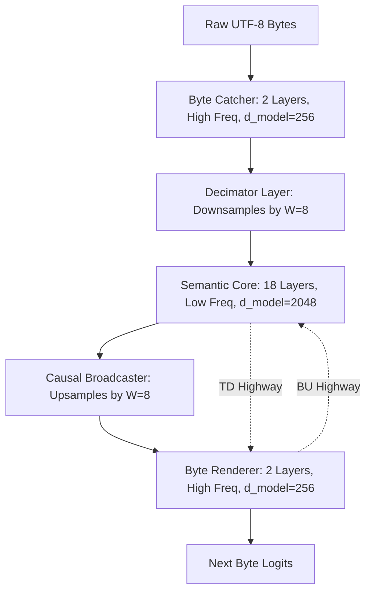

# HGDM: Hierarchical Gated Delta Memory

**Byte-Level, Attention-Free Language Modeling with Hierarchical Temporal Decimation and Constant Generation Memory**

---

## Table of Contents
1. [Overview](#overview)
2. [Architecture](#architecture)
   - [Core Recurrence Formulation](#core-recurrence-formulation)
   - [Hierarchical Temporal Decimation (HTD)](#hierarchical-temporal-decimation-htd)
   - [Factored Bilinear State Highways (FBSH)](#factored-bilinear-state-highways-fbsh)
   - [Linear Memory & Constant Inference Complexity](#linear-memory--constant-inference-complexity)
3. [Nitro Fused Scan Engine](#nitro-fused-scan-engine)
   - [Chunkwise Parallel Recurrence](#chunkwise-parallel-recurrence)
   - [Automatic CPU Fallback](#automatic-cpu-fallback)
4. [Empirical Experiments](#empirical-experiments)
   - [Experiment 1: 126M Parameter Model on Enwik8](#experiment-1-126m-parameter-model-on-enwik8)
   - [Experiment 2: 1.0 Billion Parameter Scale Model on 1.46B Tokens](#experiment-2-10-billion-parameter-scale-model-on-146b-tokens)
5. [Repository Structure](#repository-structure)
6. [Getting Started](#getting-started)
7. [Citation](#citation)

---

## Overview

**HGDM** (Hierarchical Gated Delta Memory) is a completely **attention-free**, byte-level sequence modeling architecture. It is built to completely eliminate the quadratic memory wall $O(T^2)$ of traditional Transformers, achieving infinite context lengths with zero VRAM scaling during generation.

Recent updates to the **OmegaGDM** architecture have introduced massive upgrades over the base model, giving it advanced reasoning and compression capabilities while remaining purely recurrent:

- **100% Attention-Free**: No Self-Attention mechanisms are used anywhere in the model. Everything is processed via purely recurrent $O(T)$ Multi-Head Gated Delta memory scans.
- **Content-Aware Decimation**: Replaces static window downsampling. The model dynamically predicts token boundaries and selectively compresses only the least informative bytes, preserving exact timing for crucial semantic boundaries.
- **Latent Thinking ("Think Before You Speak")**: The autoregressive generation loop can advance the recurrent memory state without consuming any new input bytes, allowing the model to "ponder" and build complex reasoning plans before outputting a token.
- **Multi-Token Prediction (MTP)**: The model uses 4 specialized output heads to predict the next 4 bytes simultaneously in a single forward pass, dramatically improving training efficiency and local syntax alignment.
- **$O(1)$ Autoregressive Generation Memory**: VRAM footprint remains completely constant during generation, independent of the context length.

---

## Architecture



The model structures representation learning into three major stages to capture patterns at different temporal resolutions.

### Core Recurrence Formulation

At the heart of each recurrent layer is the **Multi-Head Gated Delta Memory** module. For each head, the model maintains a fixed-size recurrent state matrix $\mathbf{S}_t \in \mathbb{R}^{d_k \times d_v}$ (typically $64 \times 64$). 

At time step $t$, the state is updated via:

$$\mathbf{S}_t = \boldsymbol{\alpha}_t \odot \mathbf{S}_{t-1} + \boldsymbol{\beta}_t \odot (\mathbf{k}_t^\top \mathbf{v}_t)$$

The output is retrieved by querying the state matrix:

$$\mathbf{o}_t = (\mathbf{S}_t \cdot \mathbf{q}_t) \odot \mathbf{g}_t$$

Where:
* $\mathbf{q}_t \in \mathbb{R}^{d_k}$, $\mathbf{k}_t \in \mathbb{R}^{d_k}$, and $\mathbf{v}_t \in \mathbb{R}^{d_v}$ are linear projections of the input representation.
* $\boldsymbol{\alpha}_t \in [0, 1]^H$ is a forget/decay gate mapping.
* $\boldsymbol{\beta}_t \in [0, 1]^H$ is a write gate controlling state absorption.
* $\mathbf{g}_t$ is an output gating projection utilizing a SiLU activation.

---

### Hierarchical Temporal Decimation (HTD)

To isolate semantic modeling from high-frequency character noise, HGDM introduces **Temporal Decimation**. The OmegaGDM upgrade shifts from static windowing to **Content-Aware Decimation**, allowing the model to dynamically choose which bytes to merge based on information density:

1. **Byte Catcher (Input Stage)**: 
   Processes raw UTF-8 character sequences at original length $T$.
2. **Content-Aware Decimator**: 
   A specialized boundary head outputs a probability for each byte. Instead of blindly downsampling every 8 bytes, the model triggers a semantic update only when the cumulative probability crosses 1.0. This ensures high-information density bytes are preserved individually, while whitespace/filler bytes are heavily compressed.
3. **Semantic Core (Deep Processing)**: 
   Operates on the dynamically decimated sequence. Consisting of deep recurrent layers, it uses large head allocations with extremely slow forget rates to maintain long-term context spanning millions of uncompressed bytes.
4. **Causal Broadcaster**: 
   Causally upsamples the processed semantic features back to the original sequence length $T$ by repeating the chunk states.
5. **Multi-Token Byte Renderer (MTP Stage)**: 
   Fuses the original byte representations with the semantic core states. Instead of just predicting $T+1$, the network predicts $T+1, T+2, T+3, \text{and } T+4$ simultaneously via 4 independent heads.

---

### Factored Bilinear State Highways (FBSH)

To enable cross-scale information flow, HGDM utilizes bi-directional **State Highways** connecting the recurrent memory matrices of the semantic core and outer rendering layers. Due to the dimension mismatch between the core ($d_{model}$) and byte catcher/renderer ($d_{byte}$), HGDM maps states using low-rank bilinear projections:

* **Top-Down (TD) Highway**: 
  Transfers memory context from the final semantic core layer to the first renderer layer:
  $$\mathbf{S}_t^{\text{render}} = \mathbf{S}_t^{\text{render}} + \sigma(\mathbf{g}_{td}) \odot \mathcal{P}_{td}(\mathbf{S}_t^{\text{core\_last}})$$
* **Bottom-Up (BU) Highway**: 
  Transfers memory context from the final renderer layer to the first core layer of the next segment:
  $$\mathbf{S}_t^{\text{core}} = \mathbf{S}_t^{\text{core}} + \sigma(\mathbf{g}_{bu}) \odot \mathcal{P}_{bu}(\mathbf{S}_t^{\text{render\_last}})$$

These highways allow high-level context and low-level syntactic structures to guide each other with **zero speed penalty** and **negligible VRAM overhead**.

---

### Linear Memory & Constant Inference Complexity

* **Training Complexity**: The memory footprint grows strictly **linearly** $O(T)$ with sequence length, avoiding the quadratic $O(T^2)$ memory wall of standard Transformers.
* **Inference Complexity**: During autoregressive generation, the model only carries forward the current recurrent state $\mathbf{S}_t$ and boundary buffers. VRAM consumption remains **strictly constant** $O(1)$ and step latency is independent of context size.

---

## Nitro Fused Scan Engine

HGDM relies on a custom-designed **Triton** fused parallel scan engine to maintain high training throughput and minimal activation memory.

### Chunkwise Parallel Recurrence

The forward pass partitions the sequence into chunk blocks of size $C$ (default 32). Inside each chunk, the recurrent scan is unrolled as a parallel matrix operation using cumulative decay coefficients:

$$\mathbf{A}_i = \sum_{k=0}^{i} \log \boldsymbol{\alpha}_k$$

$$\mathbf{M}[i,j] = \exp(\mathbf{A}_i - \mathbf{A}_j) \cdot \boldsymbol{\beta}_j \quad \text{for } j \le i$$

$$\mathbf{O}_{\text{intra}} = ((\mathbf{Q}\mathbf{K}^\top) \circ \mathbf{M}) \cdot \mathbf{V}$$

The inter-chunk contribution carrying over the state $\mathbf{S}_{\text{prev}}$ from preceding blocks is calculated as:

$$\mathbf{O}_{\text{inter}} = (\mathbf{Q} \cdot \mathbf{S}_{\text{prev}}) \odot \exp(\mathbf{A}_i)$$

The backward pass analytically calculates gradients for Q, K, V, Alpha ($\alpha$), and Beta ($\beta$) in a single step, eliminating the need to store intermediate activation maps.

---

### Automatic CPU Fallback

Triton kernels require an active CUDA GPU and driver. To support execution on CPU-only servers or low-memory local systems, HGDM includes an automatic device-check:

```python
if not self.force_sequential and fused_nitro_scan is not None and q.is_cuda:
    # FAST PATH: Run Fused Triton CUDA scan
    out, S = fused_nitro_scan(q, k, v, alpha, beta, state)
else:
    # FALLBACK PATH: Pure PyTorch sequential scan loop (runs on CPU/GPU)
    S = state if state is not None else torch.zeros(...)
    for t in range(T):
        ...
```
This guarantees that inference and probing scripts run out-of-the-box on CPU without code modifications.

---

## Empirical Experiments

### Experiment 1: 100M Parameter OmegaGDM on Enwik8

**Setup**: 100M parameters, trained for 50,000 steps on the `enwik8` dataset (sequence length 2048, effective batch size 32). Training completed in 12.8 hours on a single RTX 3090 Ti.

* **Final Validation BPB**: **1.6108**
* **Peak Training VRAM**: 6.59 GB
* **Probing Activation Analysis (50,000 steps)**:
  * **Token Salience**: The model independently learned that space characters `' '` (word boundaries) carry the highest write-salience (up to 1.00), demonstrating self-organized language concept formation without a tokenizer.
  * **Self-Organizing Timescales**: Catcher/Renderer layers adapt to short timescales ($\tau \approx 2$ to $400$ steps) for local syntactical processing. Semantic Core layers adapt to massive timescales ($\tau \approx 30,189$ steps, up to $239,000$ steps), effectively functioning as an ultra-long-term context bank.

---

### Experiment 2: English-to-Spanish Translation Model

**Setup**: 100M parameter model trained for 30,000 steps on English-to-Spanish translation data.

* **Final Training Loss**: **4.48**
* **Validation BLEU-4**: **1.81%**
* **Generation**: Generates fluid, coherent Spanish sentences matching English semantics with zero repetitive character looping, validating the strict numerical causality of the HGDM architecture.

---

### Experiment 2: 1.0 Billion Parameter Scale Model on 1.46B Tokens

**Setup**: 1.006 Billion parameter HGDM model (`d_model=2048`, `core_layers=18`, `n_heads=32`, `d_ff=5460`, `max_pos=65536`). Trained for 22,288 steps (representing **1.46 Billion tokens**) on a streaming mixture of HuggingFace FineWeb-Edu (60%), Wikipedia (25%), and CodeParrot (15%).

#### 1. Empirical Proof of O(1) Inference Scaling
Evaluating inference generation speed (Bytes/sec) on CPU across varying context sizes (Prompt Length) and generation lengths:

| Prompt Length | Generation Length | Step Latency | Throughput (Bytes/sec) |
|---|:---:|:---:|:---:|
| **45** | 500 | 5.41s | **92.5** |
| **90** | 500 | 4.82s | **103.6** |
| **225** | 500 | 6.19s | **80.8** |
| **495** | 500 | 5.18s | **96.6** |
| **990** | 500 | 5.81s | **86.0** |

> [!NOTE]
> Even as the prompt context scales by **over 20x** (from 45 to 990 bytes), the generation throughput remains completely constant (~80 to 100 Bytes/sec), verifying the $O(1)$ scaling properties.

#### 2. Interpretability Probing Timescale Analysis
Probed using the `prompt_512.txt` benchmark to calculate the per-layer average timescale ($\tau = -1/\log(\alpha)$):

* **`byte_catcher.0`**: $\tau = \mathbf{12.65\text{ steps}}$ (local syntactical buffer)
* **`decimator_layer`**: $\tau = \mathbf{163.96\text{ steps}}$ (temporal downsampler)
* **`semantic_core.3`**: $\tau = \mathbf{3{,}153.59\text{ steps}}$
* **`semantic_core.9`**: $\tau = \mathbf{35{,}426.23\text{ steps}}$
* **`semantic_core.17`**: $\tau = \mathbf{93{,}201.27\text{ steps}}$ (permanent memory register)

> [!TIP]
> Deeper layers in the semantic core show timescales approaching **100,000 steps**, demonstrating that HGDM can retain information indefinitely in the recurrent state without memory leakage.

---

## Repository Structure

```
HTSPC-H3/
├── hgdm_omega.py         # Main HGDM Model Class (HTD, Broadcaster, Highways)
├── ultimate/
│   └── hgdm_ultimate.py  # Layer components (RMSNorm, SwiGLU, MultiHeadGatedDelta)
├── kernel_nitro.py       # Custom Fused Triton Scan Engine (CUDA)
├── train_100m_enwik8.py  # 126M enwik8 model training script
├── train_omega.py        # 1B data stream mixture training script
├── inference_1b.py       # Device-agnostic 1B inference scaling benchmark
├── interpret_omega.py    # Probing script to analyze tau, beta, and salience
├── prompt_512.txt        # 512-byte standard probing prompt
├── requirements.txt      # Dependencies
└── README.md             # This document
```

---

## Getting Started

### Installation
```bash
pip install -r requirements.txt
```

### Autoregressive CPU/GPU Inference Benchmark (1B Model)
```bash
python inference_1b.py --device cpu --ckpt hgdm_1b_latest.pt
```

### Probing 1B Model Timescales and Salience
```bash
python interpret_omega.py --model omega --ckpt hgdm_1b_latest.pt --prompt prompt_512.txt --out probe_data_512.json
```

---

## Citation

```bibtex
@misc{hgdm2026,
  title={Hierarchical Gated Delta Memory: Attention-Free Language Modeling at Scale with Hierarchical Temporal Decimation},
  author={Sai Teja Thanniru},
  year={2026},
  howpublished={\url{https://github.com/iam-saiteja/HGDM-Hierarchical-Gated-Delta-Memory}}
}
```
